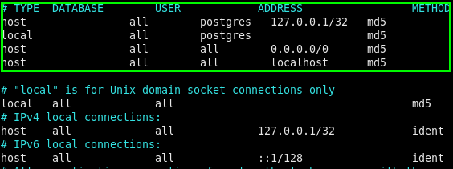
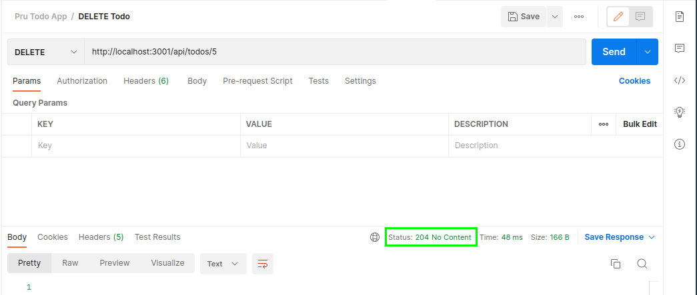

## TODO Express API App

Let's build our own Node/Express API and test it out with Postman. We will use a PostgreSQL datastore and write raw SQL to query the database.

There is a Postman collection in this folder that contains the endpoints we'll build: `pru_todo_app.postman_collection.json`

## Todo App Set-up

1. Inside the VM, let's make sure to cd into the Documents folder: `cd Documents`
1. `mkdir todo-app`
   - This will create an empty directory for our Node application
1. `cd todo-app`
   - `cd` into the directory we just created
1. `npm init -y`

   - This will create a `package.json` file to initialize our node application.

     > `package.json` is a JSON file that lives in the root directory of your project. Your `package.json` holds important information about the project. It contains human-readable metadata about the project (like the project name and description) as well as functional metadata like the package version number and a list of dependencies required by the application.

1. Open the application (so far) in VS Code: `code .`

1. `npm i cors express pg nodemon`

   - This will install a few node packages for us:
     - `cors` - (helps with potential [cross-origin resource sharing issues](https://www.telerik.com/blogs/all-you-need-to-know-cors-errors#:~:text=CORS%20errors%20happen%20when%20a,by%20the%20server's%20CORS%20configuration.))
     - `express` -[Express](https://expressjs.com/) is a minimal and flexible Node.js web application framework that provides a robust set of features for web and mobile applications.
     - `pg` - [This package](https://www.npmjs.com/package/pg) allows us to connect with our Postgres database.
     - `nodemon` - [This will automatically restart](https://www.npmjs.com/package/nodemon) the node application when file changes in the directory are detected.

1. `touch index.js` - Running this command will create a file to serve as the entrypoint of our app.

   ```js
   // imports the express npm module
   const express = require("express");

   // imports the cors npm module
   const cors = require("cors");

   // imports the Pool object from the pg npm module, specifically
   const Pool = require("pg").Pool;

   // This creates a new connection to our database. Postgres listens on port 5432 by default
   const pool = new Pool({
     user: "postgres",
     host: "localhost",
     database: "todo_app_db",
     password: "postgres",
     port: 5432,
   });

   // Creates a new instance of express for our app
   const app = express();

   // .use is middleware - something that occurs between the request and response cycle.
   app.use(cors());

   // We will be using JSON objects to communcate with our backend, no HTML pages.
   app.use(express.json());

   // This route will return 'Hi There' when you go to localhost:3001/ in the browser
   app.get("/", (req, res) => {
     res.send("Hi There");
   });

   // This tells the express application to listen for requests on port 3001
   app.listen("3001", () => {});
   ```

1. In `package.json` let's update the start script to use `nodemon`. This way we don't have to stop and restart the server each time we make a change to our code.

   ```js
   "scripts": {
     "test": "echo \"Error: no test specified\" && exit 1",
     "start": "nodemon index.js" // ADD THIS LINE
   },
   ```

1. To start the server, run `npm run start`. Go to `localhost:3001` in the broswer. you should see this:

   

## Configure Postgres in the VM

The Postgres software runs a little differently in our VM than on a Mac or PC. You can read more about that [here](https://devopscube.com/install-configure-postgresql-amazon-linux/).

1. `sudo vi /var/lib/pgsql/data/pg_hba.conf`
1. Hit `i` to insert into the file.
1. Copy and paste this:

   ```bash
   host                all        postgres   127.0.0.1/32   md5
   local               all        postgres                  md5
   host                all        all        0.0.0.0/0      md5
   host                all        all        localhost      md5
   ```

   

1. Hit `esc` then `:wq` to write and close the file.
1. Run `sudo systemctl restart postgresql` to restart the postgresql server.

## Create a sql file to create a table

There are several ways to create a database, a table, and seed it with some starter Todos. To make things simple, we'll create a `sql` file then run it to accomplish these objectives.

1. `mkdir db`
   - We'll create a separate directory for our database logic.
1. `touch db/todo.sql`

   ```sql
   CREATE TABLE todos (
     ID SERIAL PRIMARY KEY,
     title VARCHAR(50),
     done BOOLEAN
   );

   INSERT INTO todos (title, done)
   VALUES ('Get Milk', false), ('Walk Dog', false);
   ```

   - This will create a table named `todos` and insert 2 starter todos. Feel free to add some of your own.

#### YOU DO (5 minutes)

Add a few more todos based on the `INSERT INTO` example above.

## Create the todos Database

1. Let's create the database. You can run this from anywhere on the command line since it's global: `createdb todo_app_db -U postgres`

   - Note - If you're asked, the default password for the `postgres` user is `postgres`

1. Run the sql file to create the table and add 2 todos: `psql -U postgres -d todo_app_db < db/todo.sql`

   - This command will run the `todo.sql` inside the `todo_app_db` we just created. **Make sure** you're in the root directory of the app when you run this command, otherwise the `db/todo.sql` will need to be altered.
   - Note - If you're asked, the default password for the `-U postgres` user is `postgres`

1. To confirm this, we can check the `todo_app_db` database from inside the `psql` shell: `psql -d todo_app_db -U postgres`

1. `SELECT * FROM todos;`

   

## GET TODOS

We're gonna create CRUD (Create, Read, Update, Delete) functionality for for todos app. We'll start with Read.

1. You'll start to see a pattern as we build our routes. First, we'll define an HTTP verb and a method in the `index.js`. The route will accept `request` and `response` as arguments. We'll then write a database sql query inside the body like so:

   ```js
   app.get("/api/todos", (request, response) => {
     pool.query("SELECT * FROM todos ORDER BY id ASC", (error, results) => {
       if (error) throw error;

       console.log(results);
       response.status(200).json(results.rows);
     });
   });
   ```

   - You can add this route underneath the existing `app.get` method and above the `app.listen` in the `index.js` file.

1. Be sure to test this out in Postman with the provided collection of queries

   - **Instead of cloning the entire repo**... in the root of the app folder, create a new file: `touch pru_todo_app.postman_collection.json`
   - [Copy and paste the JSON object from here](https://raw.git.generalassemb.ly/ModernEngineering/express-to-do-api/main/pru_todo_app.postman_collection.json?token=AAABLBYP5VHSOCXM3JJKQBLFG4KAG)

1. When you open Postman, select "Open existing file", and open the collection.


## CREATE A TODO

1. In `index.js`, you can add this code below the previous route. _Take a minute to consider what this code is doing._

   ```js
   app.post("/api/todos", (request, response) => {
     const { title, done } = request.body;

     pool.query(
       "INSERT INTO todos (title, done) VALUES ($1, $2) RETURNING *",
       [title, done],
       (error, results) => {
         if (error) throw error;
         console.log(results);
         response.status(201).send(`Todo added with ID: ${results.rows[0].id}`);
       }
     );
   });
   ```

1. Be sure to test this out in Postman with the provided collection of queries.


## GET SINGLE TODO

1. In `index.js`, you can add this code below the previous route. _Take a minute to consider what this code is doing._

   ```js
   app.get("/api/todos/:id", (request, response) => {
     const id = parseInt(request.params.id);

     pool.query("SELECT * FROM todos WHERE id = $1", [id], (error, results) => {
       if (error) throw error;
       response.status(200).json(results.rows);
     });
   });
   ```

1. Be sure to test this out in Postman with the provided collection of queries.


## DELETE TODO

1. In `index.js`, you can add this code below the previous route. _Take a minute to consider what this code is doing._

   ```js
   app.delete("/api/todos/:id", (request, response) => {
     const id = parseInt(request.params.id);

     pool.query("DELETE FROM todos WHERE id = $1", [id], (error, results) => {
       if (error) throw error;
       response.status(204).send(`Todo deleted with ID: ${id}`);
     });
   });
   ```

1. Be sure to test this out in Postman with the provided collection of queries. First, delete a todo then get all todos to confirm it's been deleted.



## UPDATE TODO

1. In `index.js`, you can add this code below the previous route. _Take a minute to consider what this code is doing._

   ```js
   app.put("/api/todos/:id", (request, response) => {
     const id = parseInt(request.params.id);
     const { title, done } = request.body;

     pool.query(
       "UPDATE todos SET title = $1, done = $2 WHERE id = $3",
       [title, done, id],
       (error, results) => {
         if (error) throw error;
         response.status(200).send(`Todo modified with ID: ${id}`);
       }
     );
   });
   ```

   - Note - we need to send _both_ the `title` and `done` fields to the database even if we're updating only one. Otherwise, the other field will be updated with `null`. What are some strategies to avoid this? [Check this article.](https://medium.com/developer-rants/conditional-update-in-postgresql-a27ddb5dd35)

1. Be sure to test this out in Postman with the provided collection of queries.


Congrats! You built a full CRUD Todo API application and tested the endpoints with Postman!

## References

- https://expressjs.com/en/starter/generator.html
- https://blog.logrocket.com/crud-rest-api-node-js-express-postgresql/#creating-postgresql-database
- https://git.generalassemb.ly/prudential-0921/installfest
- [What is package.json](https://heynode.com/tutorial/what-packagejson/)
